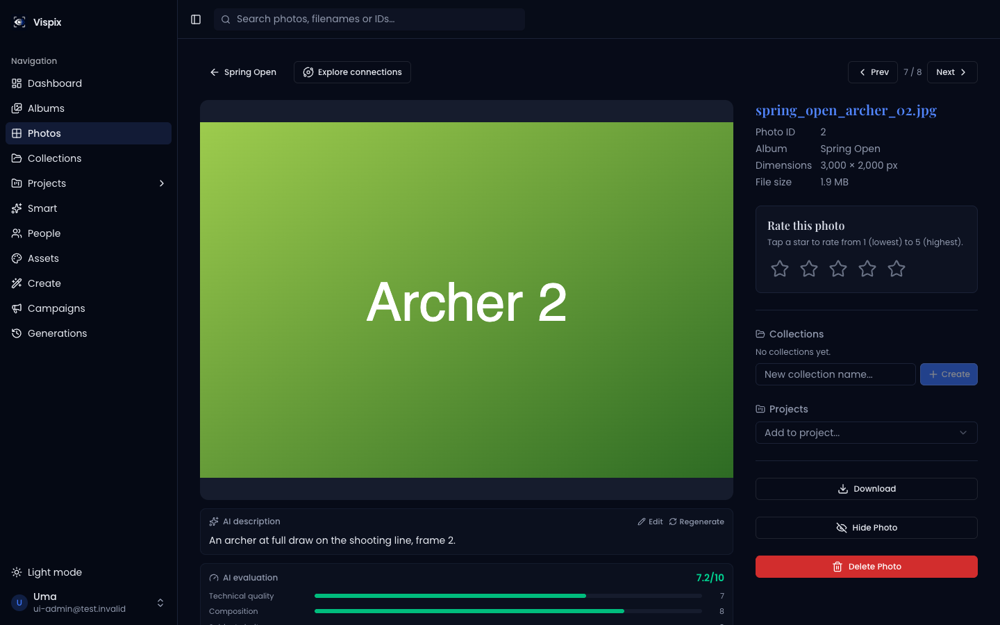
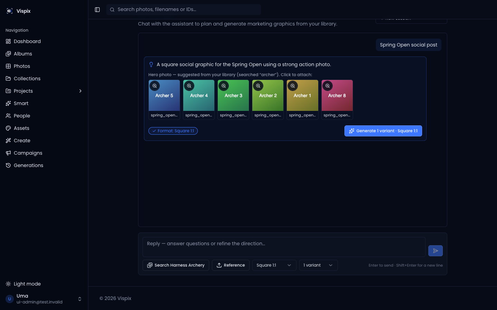
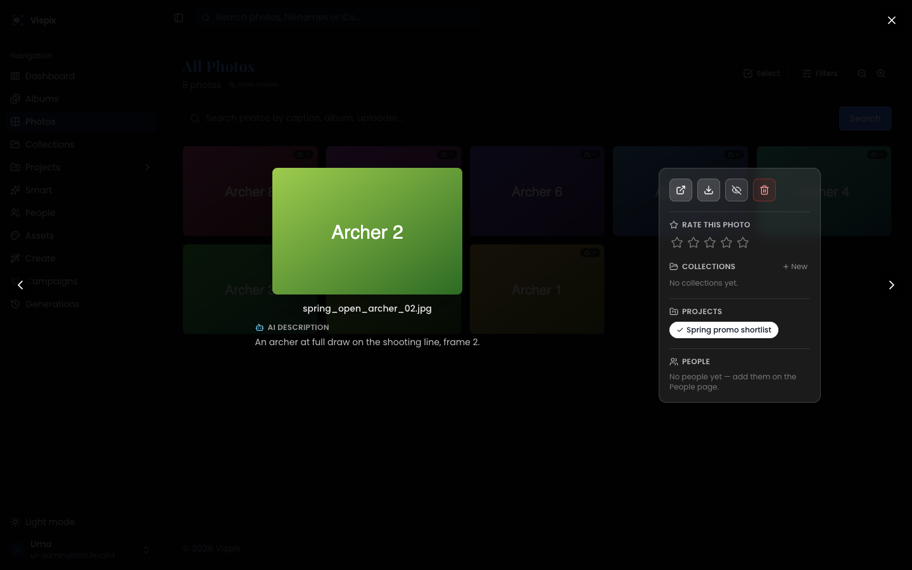
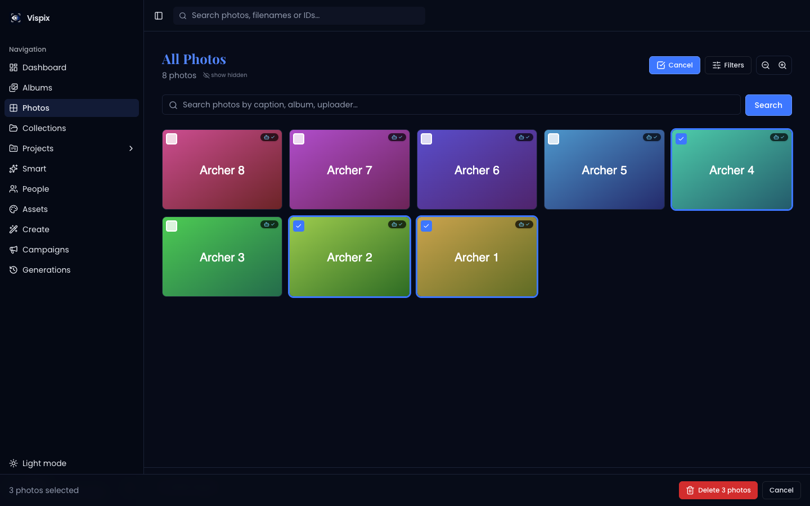
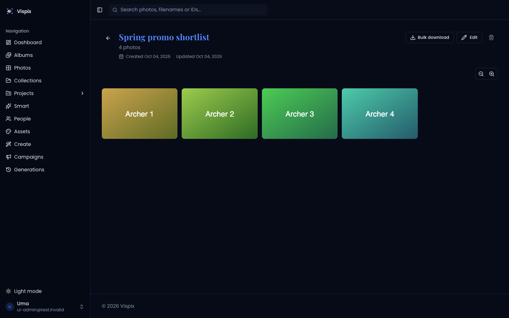
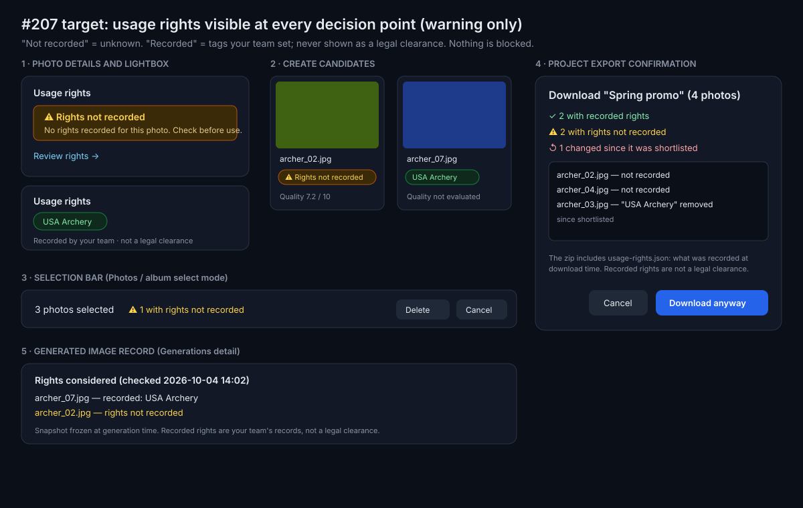

# #207 — Usage-rights states through selection, generation and export

Issue: https://github.com/shelbyklein/vispix/issues/207 · Tracker Trapper plan `99B5F8A6-BDF7-4F35-BE32-6337E642FA9F` · Branch `207-usage-rights` → PR into `dev`

## Summary

Vispix records usage rights as tags on photos ("USA Archery", "Social"), but a photo with no tag looks exactly like one nobody has thought about, and nothing warns you at the moment you pick, generate with, or export it. This work makes "rights not recorded" an explicit, visible state everywhere a photo is chosen or leaves the app, carries a timestamped rights snapshot with shortlists, generated images and exports, and never presents a team-recorded tag as a legal clearance. Nothing is blocked: the approved policy is warning-only.

## Problem

Current behaviour (verified 2026-10-04 on branch base `541d163`, synthetic harness, and on the dev library):

- **Details and lightbox** hide rights when there are none: `AttributionPanel` returns `null` for an empty tag list (`artifacts/photo-album/src/components/photo-detail/AttributionPanel.tsx`), so photo #2 below shows nothing. On dev, 5,310 of 7,481 photos (71%) have no tag, e.g. photo #1363.
- **Create candidates** carry only a name and preview (`PlanCandidate` in `artifacts/api-server/src/lib/imageGeneration/plan.ts`): no rights, no AI quality.
- **Selection** (Photos select mode) says only "3 photos selected / Delete".
- **Export** (`/projects/:id/download`) is a plain link: no confirmation, no rights in the zip, no check for rights that changed after the photo was shortlisted.
- **Generation** freezes free-text usage notes that say a photo "is cleared for: X" (`orchestrate.ts` `resolveInputs`) — overstating what a tag means — with no structured, timestamped record.
- **MCP** returns `rights: string[]` described as tags the photo "is cleared for"; an empty list is not called out as unknown.

Affected: anyone choosing photos for marketing (members and admins), and agents using the MCP connector.

| Current state (synthetic harness) | |
|---|---|
|  |  |
|  |  |
|  | |

Target (wireframe): 

## Rights-state and enforcement matrix (TT-VPX-RIGHTS-01)

Policy decided by Shelby (2026-10-04): **warning-only**; unknown is preserved explicitly; no hard blocking.

| State | Meaning | Web (manual) | Export | Generation | MCP / agents |
|---|---|---|---|---|---|
| **Not recorded** (no tag) | Unknown. Nobody has recorded rights. | Amber "Rights not recorded" in details, lightbox, Create candidates, selection bar; route to review | Listed in the confirmation; download still allowed; flagged in `usage-rights.json` | Allowed; snapshot records `not_recorded` | `rightsStatus: "not_recorded"` returned explicitly; results are not hidden or filtered unless the caller asks for a rights tag |
| **Recorded** (≥1 tag) | Your team recorded these allowed uses. Not independent legal verification. | Tags shown with "Recorded by your team · not a legal clearance" | Listed as recorded; tags in manifest | Snapshot records tag ids + names | `rightsStatus: "recorded"` + tags; description says "recorded", never "cleared" |
| **Explicit restriction** | Not modelled today. | — | — | — | — |
| **Revocation** (tag removed after shortlisting) | Rights changed since the photo was added to a project. | — | Detected at export: "changed since shortlisted" with what changed; download still allowed | Recheck happens at generation time (current state is what's snapshotted) | n/a (MCP has no write/export path) |
| **Override authority** | Nothing is blocked, so there is nothing to override. | — | — | — | — |

Blocked for **enforcement only** (needs a recorded policy decision, not part of this work): hard blocking of unknown/restricted use, override roles, autonomous-agent refusal rules.

Deferred, bounded next phase (do **not** imply these exist): structured restrictions (type, territory, channel), expiry dates, approver, release-document attachments. Shape sketched in `docs/USAGE_RIGHTS.md`.

## Success criteria

1. An untagged photo shows "Rights not recorded" in the lightbox, details page, Create candidate, selection bar and project-export confirmation, with a route to review rights — verified by screenshots from the local harness (synthetic) and on the dev stack (photo #1363).
2. Photo, list, candidate and MCP responses carry an explicit `usageRights.status` / `rightsStatus` (`recorded` | `not_recorded`) with source tag ids, and no response or UI text calls a tag a "clearance" — verified by integration tests.
3. A rights change between shortlist and export is detected and reported; generation and export records include a structured, timestamped rights snapshot — verified by integration tests and the export manifest.
4. Existing tags are untouched: migration 0040 only adds nullable/defaulted columns — verified by comparing tag counts before/after on dev.
5. `pnpm run typecheck`, the api-server and mcp-server suites, and the web build pass; PR into `dev` has green CI.

## Deliverables

| Item | End state |
|---|---|
| Code + migration `0040` on branch `207-usage-rights` | Committed, pushed, PR opened into `dev` — awaiting Shelby's review/merge |
| `docs/USAGE_RIGHTS.md` (matrix + deferred phase) and this plan | Committed on the branch |
| Tests (rights status, candidates, snapshots, export recheck, MCP) | Committed; green locally and in CI |
| Dev-stack demonstration (RIGHTS-06) | Run with the branch checked out on the Beelink, then the Beelink returned to `dev`; evidence attached to the issue |
| Production release (RIGHTS-07) | **Not authorized** — stays blocked |

## Workflow (dependency-ordered)

| Todo | Task | Acceptance check |
|---|---|---|
| TT-VPX-RIGHTS-01 | Agree the rights-state and enforcement matrix | Matrix above covers unknown, recorded, restrictions, revocation, manual vs autonomous, override authority; enforcement recorded as blocked pending policy |
| TT-VPX-RIGHTS-02 | Backward-compatible rights metadata and queries | Migration 0040 adds `project_photos.rights_snapshot` (nullable) and `image_generations.rights_snapshot` (default `[]`); tag rows unchanged; photo/list/candidate responses include `usageRights` with status + tags; tests prove untagged = `not_recorded`, org-scoped |
| TT-VPX-RIGHTS-03 | Surface rights and quality at decision points | Screenshot of an untagged fixture shows the warning in details, lightbox, Create candidate (+ quality or "not evaluated"), selection bar, export confirmation, each with a review route |
| TT-VPX-RIGHTS-04 | Carry and revalidate usage context | Tests: removing a tag after shortlisting is reported by the export rights check; generation stores a structured snapshot; zip manifest lists status per photo with `checkedAt`; nothing blocks |
| TT-VPX-RIGHTS-05 | Validate and build | Typecheck, api-server + mcp-server suites, web build pass at the PR head; results recorded |
| TT-VPX-RIGHTS-06 | Demonstrate on dev | Branch on the Beelink dev stack, migration applied, photo #1363 screenshots + export manifest + tag counts before/after; Beelink returned to `dev` |
| — **Gate: Shelby reviews and merges the PR into `dev`** | | |
| TT-VPX-RIGHTS-07 | Authorized rollout | Blocked until a separate release authorization |

## Scope boundaries

- No hard blocking, override roles, or agent refusal rules (policy-dependent).
- No restriction/expiry/approver/release-document fields — specified as a later phase only.
- No change to existing tags, tag permissions (#218 matrix), or how tags are set.
- No legal-clearance wording anywhere; "recorded by your team" only.
- No MCP write tools; no production release; #150 is separate and stays blocked on prod credentials.

## Open questions (none blocking)

- Enforcement policy (blocking/overrides) — future decision; this work is warning-only by approval.
- Whether to backfill shortlist snapshots for existing project photos — not done; existing rows read as "not captured at shortlist time".

## Rollback

Migration 0040 is additive (two new columns, no data changed). Roll back by reverting the merge commit; the columns can stay. No backup needed for an additive migration beyond the standard deploy procedure.

## Test plan

- `TEST_DATABASE_URL=… pnpm run test` (api-server + mcp-server) on the local test Postgres; new `usageRights.integration.test.ts` and MCP rights assertions.
- `pnpm run typecheck`; `cd artifacts/photo-album && PORT=8081 BASE_PATH=/ npx vite build`.
- UI: real entry points in the local harness (synthetic data) — details, lightbox, Create plan, Photos select mode, project export dialog — screenshots compared with the "before" set; then the dev stack with photo #1363.

## Work preparation

Readiness: pass · 2026-10-04 · R1–R11, R13 pass · R3 pass (current-state screenshots + target wireframe above) · R12 pass (additive migration, rollback above).
Execution mode: **linear** — one tightly coupled contract (API types shared by web, MCP and generation), so parallel lanes would collide.
Model: **Claude Opus 5.5** (this session), session-default effort.
