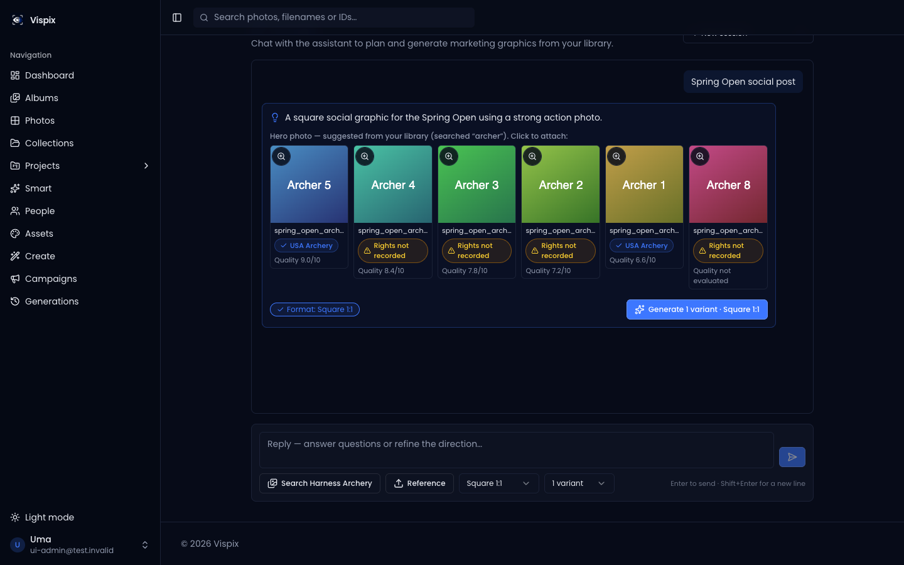
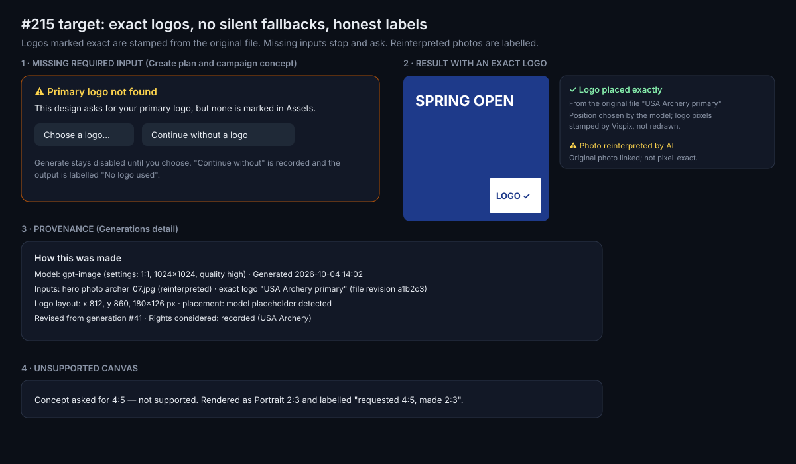
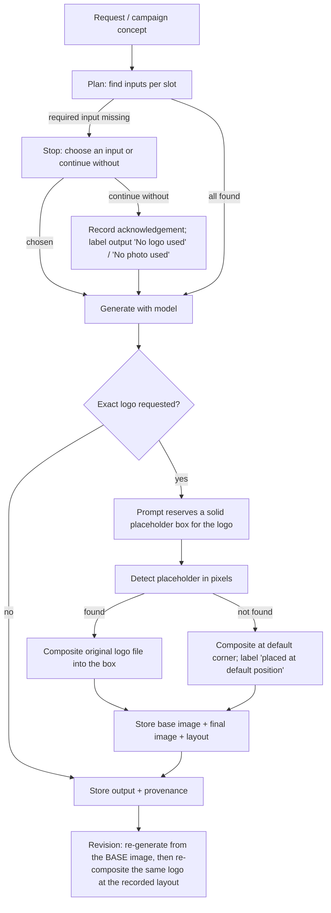

# #215 — Asset fidelity and missing inputs in Create and Campaigns

Issue: https://github.com/shelbyklein/vispix/issues/215 · Tracker Trapper plan `65CBE90A-16C7-4209-8386-464A286F2AC5` · Handoff: [handoff.md](handoff.md)

## Summary

When someone asks Create or a campaign for a graphic with their logo, Vispix only *asks* the image model to keep the logo exact — the model redraws it, so it can come out wrong. And when a campaign can't find the photo or logo it needs, it quietly generates without them. This work stamps the original logo file onto the output (the model only decides where it goes), stops and asks when a required input is missing, records how each image was made, and labels AI-reinterpreted photos honestly.

## Problem

Current behaviour (`dev` at `c69eceb`, source-verified 2026-10-04):

- **Exact logos are a prompt request only.** `ROLE_INSTRUCTIONS.exact_asset` in `artifacts/api-server/src/lib/imageGeneration/orchestrate.ts` tells the model "never redraw" — nothing composites the real file.
- **Silent ungrounded campaign renders.** `campaignSuggestions.ts` logs "Campaign concept grounding failed — generating without inputs" and generates anyway.
- **Create's planner** proposes candidates per slot (`plan.ts` `heroPhotoQuery` / `brandAssetQuery`) but nothing marks a slot as required or blocks Generate when it's empty.
- **Unsupported canvases** are silently replaced: a campaign concept's format falls back to `"1:1"` (`campaignSuggestions.ts`) with no label.
- **Provenance is partial:** inputs, prompt, settings and usage/rights snapshots are stored; the exact asset revision, layout and fidelity mode are not.
- Revisions became stateless (store off, #243): they re-send the parent image, so an exact logo baked into the parent could be redrawn by the model on revision.

Affected: anyone producing branded graphics; the risk is an off-brand or wrong logo, or a graphic with no real photo, presented as finished work.

Current state:  — candidates are offered, but nothing is required or exact.

Target (wireframe): 

### Flow

## Decisions (settled 2026-10-04 with Shelby)

| Question | Decision |
|---|---|
| What "exact" covers in v1 | **Logos only** (PNG/JPG/WebP; SVG rasterised server-side with sharp). Exact text overlays are a later phase. |
| Placement | **Model decides, we overlay.** The prompt asks the model to leave a flat placeholder box (a fixed key colour) where the logo belongs; Vispix detects it and composites the original logo into it, preserving aspect ratio. Fallback when no placeholder is found: default bottom-right corner, labelled. |
| Missing required input | **Stop and ask.** Generate is disabled until the person picks an input or explicitly continues without it; continuing is recorded and labels the output. Applies to Create and Campaigns. |
| Hero photos | **Honest label.** Keep the model's reinterpretation; label outputs "Photo reinterpreted by AI" and link the original. Pixel-exact photo panels are a later phase. |

## Success criteria

1. A logo marked exact is composited from the original file: pixel-comparison fixtures show the logo region of the output equals the (resized) source logo, independent of the provider (tests).
2. A missing required photo/logo cannot silently become an ungrounded render in Create or Campaigns: the API refuses without an explicit acknowledgement and the UI shows the choice (tests + harness screenshots).
3. Every output records model, settings, inputs with asset revision, fidelity mode, logo layout, placement method, grounding acknowledgements and format requested vs rendered, shown in the Generations detail (tests + screenshot).
4. Revisions keep the exact logo at its recorded layout and lineage (tests).
5. With separate spend authorization: one real-provider run on dev shows a correctly placed exact logo, the photo label, and output dimensions (screenshot); otherwise this criterion stays blocked.

## Deliverables

| Item | End state |
|---|---|
| Shared contract (types + docs) | Committed to `dev` by the coordinator before lanes start |
| Lane A: composition, provenance, revisions, formats, migration `0041` | Committed on a lane branch → integrated into `dev` by the coordinator |
| Lane B: required-input resolution in planner, campaigns and UI | Committed on a lane branch → integrated into `dev` |
| Tests (pixel fixtures, API, campaign) and harness screenshots | Committed with the lanes; screenshots under this folder (synthetic data) |
| PR into `dev` | Opened by the coordinator after integration — awaiting Shelby's review |
| Real-provider acceptance (FIDELITY-04 part 2) | **Needs Shelby's spend authorization** |
| Production release (FIDELITY-07) | **Needs a separate release authorization** |

## Workflow

| Todo | Task | Owner | Acceptance check |
|---|---|---|---|
| TT-VPX-FIDELITY-01 | Define fidelity modes and the smallest deterministic composition pipeline | Coordinator | This plan + `docs/IMAGE_FIDELITY.md` state supported inputs, placement, allowed photo treatment, dimensions, lineage, unsupported formats, missing-input resolution; fixtures (logo PNG + SVG, synthetic photo) committed |
| TT-VPX-FIDELITY-02 | Required-input validation and provenance | Lane B (validation) + Lane A (provenance) | Missing required input → API 409 `input_required` unless acknowledged; campaigns return `needs_input` concepts instead of ungrounded renders; snapshots include input identity, asset revision, rights, model, settings |
| TT-VPX-FIDELITY-03 | Exact composition and revision semantics | Lane A | Pixel tests: logo region matches source within tolerance for placeholder-found and default-corner cases; SVG logo rasterised; revision re-composites at the recorded layout; failed composition leaves a visible failed generation (no "succeeded" without the logo) |
| TT-VPX-FIDELITY-04 | Verify with deterministic and real-provider outputs | Coordinator | Deterministic part: fixtures above pass. Real-provider part: **blocked until spend is authorized**, then one dev run with screenshots |
| TT-VPX-FIDELITY-05 | Validate and produce the reviewable build | Coordinator | Typecheck, api-server + mcp-server suites on the isolated test DB, web + api builds pass at the PR head |
| TT-VPX-FIDELITY-06 | Demonstrate in the dev environment | Coordinator | Dev stack on the integrated branch: missing-input stop, exact-logo composite (with mocked provider in a harness, or real provider if authorized), provenance panel; temp data cleaned |
| — **Gate: Shelby reviews/merges the PR into `dev`; spend authorization for the real-provider run** | | | |
| TT-VPX-FIDELITY-07 | Authorized rollout | Coordinator | Blocked until a separate release authorization |

### Issue checks narrowed by the decisions

The issue's original checks mention exact **text** placement (FIDELITY-01/03) and a **protected photo region** (FIDELITY-01/04). Per the 2026-10-04 decisions these are deferred to a later phase: v1 checks cover exact **logos** only, and photos are labelled "reinterpreted" rather than protected. Todo IDs are unchanged; the fixtures include a logo (PNG + SVG) and a synthetic photo used for the "reinterpreted" label, not a protected region.

## Scope boundaries

- No design editor, no exact text overlays, no pixel-exact photo panels, no model selector (#188), no auto-publishing.
- Generated images stay outside photo analysis/embeddings (#194 behaviour unchanged).
- Usage-rights behaviour (#207) unchanged: warning-only; rights snapshots keep working.
- Existing generations keep rendering; new provenance fields are null for old rows.
- No production release; #150 untouched.

## Open questions (none blocking)

- Placeholder key colour and detection tolerance — Lane A picks and documents; tuned during the real-provider run.
- Whether "continue without" should be available for campaigns run in bulk — default yes, per concept.

## Rollback

Migration `0041` is additive (new nullable columns on `image_generations` for composition/provenance, and the stored base image key). Roll back by reverting the merge; columns can stay. Composited outputs are new files; the base image is kept, so no data is lost.

## Test plan

- `TEST_DATABASE_URL=… pnpm run test` (api-server + mcp-server) on the local test Postgres; new composition pixel tests (sharp, no provider), required-input API tests, campaign `needs_input` tests, revision re-composite tests, provenance serialisation tests (member/manager redaction from #243 audit preserved).
- `pnpm run typecheck`; `cd artifacts/photo-album && PORT=8081 BASE_PATH=/ npx vite build`; api build.
- UI: local harness with synthetic data and a mocked image provider (returns a fixture image containing the placeholder box) — Create plan with a missing logo, the choose/continue-without flow, an exact-logo result, the Generations provenance panel; screenshots compared with the "before".
- Real provider: only after spend authorization (FIDELITY-04).

## Execution mode and models

**Orchestrated** — two independent lanes with no file overlap (backend composition/provenance vs planner/campaign/UI resolution) save real time; the shared contract is committed first.

| Role | Model | Effort |
|---|---|---|
| Coordinator + integration + FIDELITY-01/04/05/06/07 | Claude Opus 5.5 (this session) | session default |
| Lane A — composition, provenance, revisions, formats, migration | Claude Sonnet 5.5 (`claude-sonnet-5-5`) | default |
| Lane B — required-input resolution, campaigns, Create/Campaign UI | Claude Sonnet 5.5 (`claude-sonnet-5-5`) | default |

## Work preparation

Readiness: pass · 2026-10-04 · R3 pass (current screenshot, target wireframe, flow diagram) · R12 pass (additive migration 0041). Scope and the four decisions confirmed by Shelby 2026-10-04. Handoff: [handoff.md](handoff.md). Now/later: pending.
