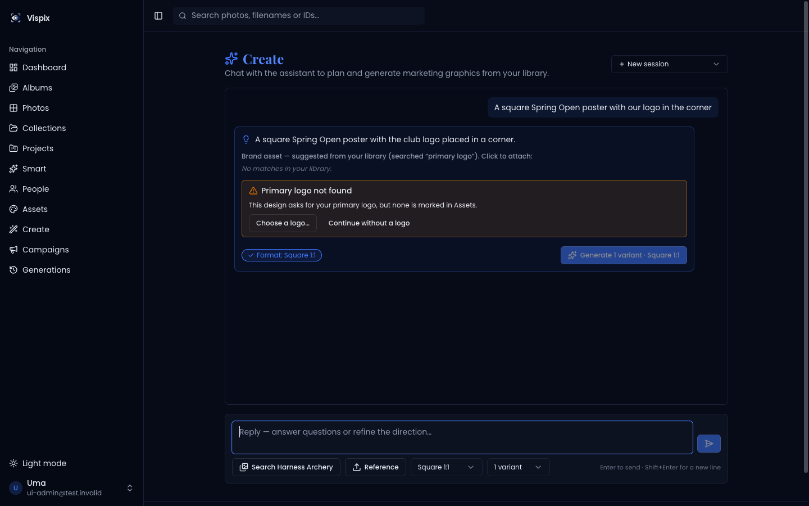

# #250 — Remove image generation and campaigns

Issue: https://github.com/shelbyklein/vispix/issues/250

## Summary

Vispix stops generating images. Create, Generations and Campaigns are removed so a separate tool can do that work. Photos and brand Assets stay, and outside tools reach both through the MCP connector (`search_photos`, `get_photo`, `list_assets`, `get_asset`).

## Problem

Image generation (Create #167, Campaigns #216, fidelity #215, limits #229, privacy #243) is a large surface: an OpenAI image pipeline, a planner, logo compositing, two pages plus a slide-out panel, three tables and a stored-image prefix. Shelby wants that handled elsewhere (2026-10-06). Current footprint on `dev` at `a66a06c`:

- API: `routes/imageGeneration.ts`, `routes/campaigns.ts`, `lib/imageGeneration/*` (incl. `assetRanking.ts`, used only by the planner), `failOrphanedGenerations` at startup (`index.ts`), generation/campaign parts of `lib/platformDeletion.ts`, `GENERATION_*` env vars.
- DB: `image_generation_sessions`, `image_generations`, `campaigns` (only `campaigns.session_id` and `image_generations.session_id` reference these; nothing kept references them).
- Storage: `orgs/<id>/generated/*` (15 files on dev).
- Web: `pages/create.tsx`, `generations.tsx`, `campaigns.tsx`, `campaign-detail.tsx`, `components/CreatePanel.tsx`, `lib/create-panel.ts`, `lib/fidelity.ts`, routes in `App.tsx`, three sidebar items in `AppLayout.tsx`, client hooks `lib/api-client-react/src/create.ts` + `campaigns.ts`.
- Not in `openapi.yaml` (hand-written client), so no codegen.

Before (sidebar shows Create, Campaigns, Generations): 

Target: the sidebar ends at Assets (Dashboard, Albums, Photos, Collections, Projects, Smart, People, Assets). `/create`, `/generations`, `/campaigns*` redirect to the dashboard.

## Decisions (Shelby, 2026-10-06)

| Question | Decision |
|---|---|
| Assets (logos) | **Keep** the page, API and MCP asset tools |
| Existing data | **Delete everything, no export**: drop the three tables and delete stored generated images. Dev on merge into `dev`; prod only with release |
| Rollout | Plan, build, merge into `dev`, demo on dev; prod waits |
| #188 (choose model) | Closed as not planned |

## Success criteria

1. No route, page, sidebar item, panel or client hook for Create, Generations or Campaigns remains; `/api/image-generation/*` and `/api/campaigns*` return 404.
2. Assets page, assets API and MCP `list_assets`/`get_asset` work unchanged (existing tests pass).
3. Migration drops the three tables; nothing else changes in the schema.
4. Typecheck 0 errors; api-server and mcp-server suites pass; web and api builds pass.
5. On dev after merge: tables gone, `orgs/*/generated/` files deleted, app healthy, sidebar screenshot.

## Deliverables

| Item | End state |
|---|---|
| Server removal + migration | Lane A commits → PR into `dev` |
| Web removal | Lane B commits → same PR |
| Screenshots (synthetic harness) | `after-sidebar.png`, `after-old-url.png` in this folder |
| Dev data deletion | Done by the coordinator after merge, reported with counts |
| Prod release + prod data deletion | **Needs Shelby's separate authorization** |

## Workflow

| Todo | Task | Owner | Check |
|---|---|---|---|
| REMOVEGEN-01 | Server removal + migration | Lane A | Routes 404, migration drops only the three tables, suites pass |
| REMOVEGEN-02 | Web removal | Lane B | No references remain, redirects work, build passes |
| REMOVEGEN-03 | Validate + screenshots | Coordinator | Full checks at PR head, screenshots inspected |
| REMOVEGEN-04 | Merge into dev, clear dev data | Coordinator | Tables gone, files deleted, health 200 |
| — Gate: release authorization | | | |
| REMOVEGEN-05 | Release to prod | Coordinator | Blocked until authorized |

## Scope boundaries

- Keep: photos, albums, collections, projects (incl. their #207 rights snapshots), people, Assets, usage rights, AI photo analysis, OpenAI key settings (still used for analysis), MCP.
- Generic upload references made from Create (`uploads/` prefix) can't be told apart from asset uploads and are left in storage.
- Old plan docs (#167, #215, #216) stay as history; current docs (`IMAGE_FIDELITY.md`, CLAUDE.md gotcha, MARKETING/RELEASE/RETRIEVAL mentions) are updated or removed.

## Rollback

Code: revert the merge. Data: none. The tables and generated images are deleted by decision, so a rollback restores the feature with empty history.

## Test plan

Typecheck; `TEST_DATABASE_URL=… pnpm run test` (api-server then mcp-server); web + api builds; route 404 checks; local harness screenshots of the sidebar and an old URL; dev smoke after merge.

## Execution mode and models

**Orchestrated**: two lanes with no file overlap (server vs web) — Claude Sonnet 5.5 (`claude-sonnet-5-5`) each; coordinator Claude Opus 5.5 (this session) integrates, verifies, merges and clears dev data.

## Work preparation

Readiness: pass · 2026-10-06 · scope and decisions confirmed by Shelby · R3 before screenshot + target described · R12 rollback above (destructive by decision). Now.
