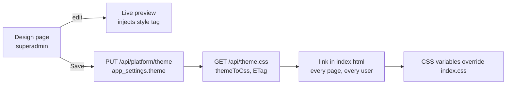

# #253 — Design page: edit the site's theme live

Issue: https://github.com/shelbyklein/vispix/issues/253 · Builds on the design map (`docs/design/vispix-design-map.html`).

## Summary

The design map becomes a working control panel. A superadmin **Design** page edits the design tokens (colors for light and dark, fonts, corner radius, shadow strength), previews the change across the app instantly, and saves it. Every page picks up the saved theme on its next load, with no code change or release.

## Problem

The whole look comes from CSS variables in `artifacts/photo-album/src/index.css` (see the design map's "How styling flows"), but the only way to change them is a code edit and a deploy. Two gaps also keep parts of the look out of reach of any token: warning/success colors are hard-coded Tailwind amber/emerald (~270 uses), and buttons/badges reference `hover-elevate` / `active-elevate-2` utilities that are never defined, so they have no hover state.

## How it works

- Shared contract: `lib/api-zod/src/theme.ts` (`COLOR_TOKENS`, `DEFAULT_THEME`, `PlatformThemeSchema`, `themeToCss`, API shapes). Used by both the API and the web app.
- Overrides use doubled selectors (`:root:root`, `:root:root.dark`) so they win whatever the stylesheet order.
- No saved theme → `/api/theme.css` is empty and `index.css` applies unchanged. Reset deletes the saved theme.
- Fonts load from Google Fonts via `@import` (already allowed by the CSP's `style-src`).

## Decisions (Shelby, 2026-10-06)

| Question | Decision |
|---|---|
| Mechanism | Live theme in the database, no deploy |
| Who | Superadmin only, one platform-wide theme |
| Controls | Colors (light + dark), fonts, shape (radius, shadows) |
| Gaps | Fix first: warning/success tokens, hover/press states |
| Rollout | Build, merge into `dev`, demo on dev; prod waits |

## Success criteria

1. Changing a token on the Design page previews immediately across the app; Save makes every page (any user, signed in or not) show it on next load; Reset restores today's look.
2. With no saved theme, the app looks the same as today (visual parity), apart from the new hover/press states.
3. Warning/success colors and button hover are controlled by tokens (no remaining hard-coded amber/emerald for status UI).
4. Only the superadmin can read or change the theme; invalid values are rejected (400).
5. Typecheck 0 errors; suites and builds pass; screenshots of the Design page and a changed theme on other pages in light and dark.

## Workflow

| Todo | Task | Owner | Check |
|---|---|---|---|
| THEME-01 | Shared contract | Coordinator | Done in this branch |
| THEME-02 | Server: storage, migration, endpoints, tests | Lane A | Endpoint + auth + validation tests; defaults-match-index.css test |
| THEME-03 | Token gaps: warning/success, hover/press | Lane B | No hard-coded status amber/emerald left; parity screenshots |
| THEME-04 | Design page + theme link | Lane C | Screenshots: edit, preview, save, reset |
| THEME-05 | Validate | Coordinator | Full checks at PR head |
| THEME-06 | Merge into dev, demo | Coordinator | Theme changed and reset on dev |
| — Gate: release authorization | | | |
| THEME-07 | Release | Coordinator | Blocked until authorized |

## Scope boundaries

- Not per-organization branding; not logos or copy; not layout/spacing beyond radius and shadows.
- Fonts limited to the curated Google Fonts list in the contract.
- The static design map stays as reference and points to the Design page.

## Rollback

Reset on the Design page restores the built-in theme instantly. Code: revert the merge; the migration only adds nullable columns.

## Test plan

Typecheck; api-server and mcp-server suites (sequential); web + api builds; local harness screenshots (synthetic data) of the Design page, a saved theme on the dashboard/photos pages in light and dark, and after reset; status-chip and button parity before/after.

## Execution mode and models

**Orchestrated**: three lanes with no file overlap — Claude Sonnet 5.5 each (A server, B token gaps in existing components + `index.css`, C new Design page + `index.html` + client hooks). Coordinator Claude Opus 5.5 wrote the contract, integrates, verifies and merges.

## Work preparation

Readiness: pass · 2026-10-06 · scope and decisions confirmed by Shelby · R3 flow diagram above, current look in the design map · R12 rollback above. Now.
