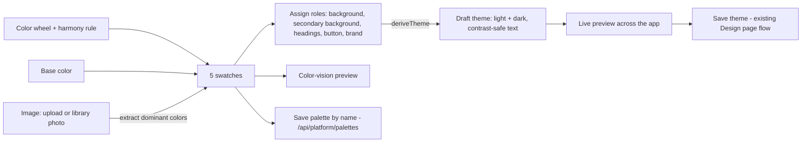

# #257 — Design page: color palette tool

Issue: https://github.com/shelbyklein/vispix/issues/257 · Builds on the Design page (#253) and the Sunset rebrand.

## Summary

A **Palette** panel on `/superadmin/design` that helps pick colors, modeled on Adobe Express's "Color palette generator and color wheel tool" (reference shared by Shelby 2026-10-07: a hue/saturation wheel with linked draggable points, a harmony-rule row, base color / image / color wheel tabs, five tall swatches with hex + copy, and a named palette). Picking a palette and assigning its swatches to roles turns it into the whole theme, previewed live, with text colors and dark mode derived for contrast.

## How it works

Contract: `lib/api-zod/src/palette.ts` (rules, roles, color visions, `harmony`, `hexToWheel`, `wheelToHex`, `moveOnWheel`, `extractPalette`, `simulateColorVision`, `contrastRatio`, `deriveTheme`, saved-palette schema and routes).

## Decisions (Shelby, 2026-10-07)

| Question | Decision |
|---|---|
| Features | Color wheel + harmonies, base color, from an image (upload or library photo). Not: random, lock, undo |
| Applying | Assign swatches to roles; text and dark mode derived with contrast checks; live preview before saving |
| Saving palettes | Named list, platform-wide, superadmin only, separate from the live theme |
| Accessibility | Color-vision preview (protanopia, deuteranopia, tritanopia, achromatopsia) |
| Rollout | Merge into `dev`; prod together with the Design page release |

## Success criteria

1. Dragging any wheel point moves the related points per the harmony rule; changing the rule regenerates the palette; a typed base color generates a palette.
2. An uploaded image or a library photo yields a palette of its dominant colors.
3. Assigning roles and pressing Apply updates the draft theme for light and dark; every text pair reaches 4.5:1 (headings 3:1) — unit-tested on several palettes, including the Sunset palette.
4. The color-vision preview re-renders the swatches (and optionally the app preview) for each mode.
5. Palettes save, reopen and delete; only the superadmin can use the API.
6. Typecheck 0; suites and builds pass; screenshots of each mode.

## Workflow

| Todo | Task | Owner |
|---|---|---|
| PALETTE-01 | Contract | Coordinator (done) |
| PALETTE-02 | Engine + unit tests | Lane A (Sonnet 5.5) |
| PALETTE-03 | Saved palettes API + migration + tests | Lane B (Sonnet 5.5) |
| PALETTE-04 | Palette panel UI | Lane C (Sonnet 5.5) |
| PALETTE-05/06 | Integrate, validate, screenshots, merge into dev | Coordinator |

## Scope boundaries

Superadmin Design page only. No per-org palettes. Uses existing photo access for library photos (thumbnails, same-origin). Doesn't change the built-in theme by itself — applying a palette changes the draft; saving uses the existing Save.

## Rollback

Revert the merge; the migration only adds a table.

## Test plan

Engine unit tests (api-server vitest importing `@workspace/api-zod/palette`); API integration tests; typecheck; builds; harness screenshots of wheel, base color, image (upload + library), roles applied (light + dark), color-vision modes, saved list.

## Execution mode

Orchestrated: three Sonnet 5.5 lanes with separate files (engine in `palette.ts` + its test; server routes/schema; UI components). Coordinator Claude Opus 5.5.

## Work preparation

Readiness: pass · 2026-10-07 · scope confirmed by Shelby · R3 flow above + reference described · R12 rollback above. Now.
